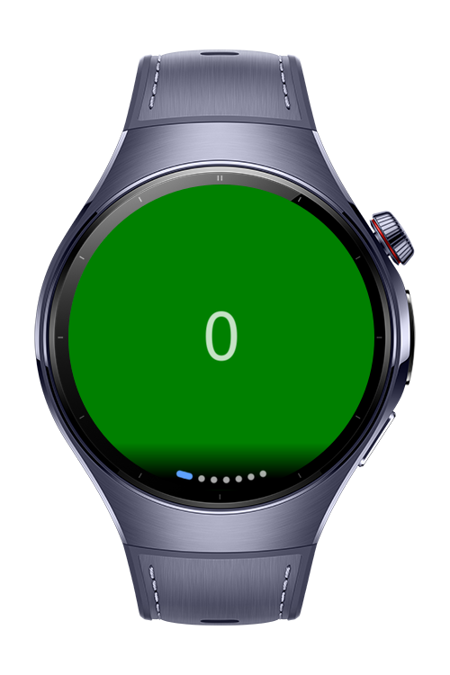
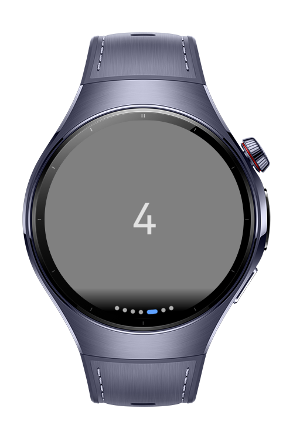

> **Note:** To access all shared projects, get information about environment setup, and view other guides, please visit [Explore-In-HMOS-Wearable Index](https://github.com/Explore-In-HMOS-Wearable/hmos-index).

# How to use ArcSwiper


ArcSwiper is a HarmonyOS Next wearable app that demonstrates the usage of the ArcSwiper component for circular screens.
The project shows how to build a carousel-like swiper with child components arranged in an arc, suitable for watches and other round devices.

# Preview

<div>
  
  
</div>

<br/>

# Use Cases

- Display a carousel of items on circular wearable screens using ArcSwiper.

- Handle custom animations and swipe gestures for smooth user experience.

- Prevent unwanted gestures by controlling pan gesture recognition.

- Use ArcDotIndicator and ArcSwiperController for navigation and state management.

# Tech Stack

**Languages**: ArkTS

**Frameworks**: HarmonyOS SDK 5.1.0(18)

**Tools**: DevEco Studio Vers 5.1.0.842

**Libraries**: @kit.ArkUI

<br/>

# Directory Structure
```
entry/src/main/ets/
├── pages/
│   └── Index.ets                # Main page
│
├── entryability/
│   └── EntryAbility.ets         # App ability
│
├── module.json5                 # App metadata, permissions, device config
└── build-profile.json5          # Build, signing, and SDK configuration
```


# Constraints and Restrictions

## Supported Device
- Huawei Watch 5


# License

**ArcSwiper** is distributed under the terms of the MIT License.

See the [LICENSE](/LICENSE) for more information.